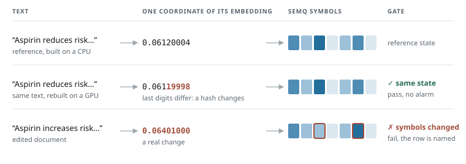

# Rebuild detection

Rebuilding an embedding corpus can change its floating-point values even when its text and encoder are unchanged. SEMQ turns each embedding into symbols, reports changed row IDs, and compares the differences with a floor: the largest variations observed in unchanged rebuilds. Passing the gate means the candidate stayed within that measured envelope; it does not establish semantic equivalence.

<figure class="semq-figure" markdown="1">

<figcaption>Illustrative values. A real rebuild can change some symbols within the floor, and a small edit can leave every symbol unchanged.Scroll horizontally to view the full illustration.</figcaption>

</figure>

**Setup:** 5,183 SciFact documents · `e5-small-v2` · quant with four bins.

Each section is a separate experiment with its own calibration. The hardware and frozen results are listed with that experiment.

- **No false alarms on real rebuilds:** none with 20 rebuilds in the floor, over 2,000 resamples of 28 rebuilds, where a hash of the floats, `np.allclose` and a fixed tolerance rejected all of them.
- **Real changes caught:** 4 of 4 pipeline changes, and one swapped word in one document 96.8% of the time.
- **A compact, portable state.** A float check calibrated on the same rebuilds catches content changes as well, catches small numeric faults better and can list rows too; SEMQ compares a compact state that every platform reads the same way and reports a structured diff.

## How the gate decides

Here a row is one document's embedding. The reference is the state you trust; a candidate is a new rebuild. A row's hamming is how many of its symbols differ from the reference, and the p99 is taken over the changed rows only, not over the whole corpus.

<figure class="semq-gate" aria-label="Calibrate the floor, then evaluate a candidate">

1 · Calibrate
<strong>20 unchanged rebuilds</strong>

Compare each with the same reference. Keep the largest observed value of each statistic as the floor.

2 · Evaluate
<strong>One candidate rebuild</strong>

Compare it with that reference, then check each value against its floor limit.

<ul class="semq-gate__checks">
<li>Changed rows<code>243 ≤ 280</code><strong class="is-pass">Within</strong></li>
<li>p99 symbols changed<code>2 ≤ 2</code><strong class="is-pass">Within</strong></li>
<li>Most symbols changed in one row<code>267 > 3</code><strong class="is-fail">Exceeds</strong></li>
</ul>
<figcaption>Illustrative candidate from the measured synthetic pool. <code>within</code> accepts the first two values; <code>per-row</code> also checks the last and flags 2 rows.</figcaption>
</figure>

Measure a floor for a specific reference and expected rebuild settings. Recalibrate when the reference or noise regime changes. Each candidate is compared with that reference: `within` checks the changed-row ratio and p99 Hamming; `--per-row` also checks the largest row change. The example shows the numeric checks; a changed encoder manifest also fails the gate.

## Real pipeline changes

A floor measured from 3 unchanged rebuilds, then seven candidates: two more unchanged rebuilds and five changes to the pipeline. Each bar is the share of rows whose symbols changed, not how serious the change is. Moving the normalization after the model shifts no coordinate by more than 3e-8, so it counts as no change: four real changes remain.

Hardware: CPU: Apple M4 Pro (arm64) · GPU: Apple M4 Pro (MPS).

<strong>GPU rebuild, different batch size</strong>0.10% · within floor

<strong>CPU rebuild, one document per batch</strong>0.02% · within floor

<strong>Previous encoder revision</strong>100% · outside floor

<strong>Half precision</strong>51.0% · outside floor

<strong>128-token truncation</strong>98.1% · outside floor

<strong>CLS instead of mean pooling</strong>100% · outside floor

<strong>Normalization moved after the model</strong>0% · within floor

The floor allowed 5 of 5,183 rows to change, by at most 1 symbol each.

**The same runs, judged by other checks.** A false alarm flags a rebuild with unchanged text and encoder; a miss lets a tested pipeline change pass. False alarms count only the 2 rebuilds held out from the 3 used to measure the floor.

| Check | False alarms on held-out rebuilds | Tested changes missed |
| --- | ---: | ---: |
| Hash of the FP32 bytes | 2 of 2 | 0 of 4 |
| `np.allclose`, default tolerances | 2 of 2 | 0 of 4 |
| Any row with cosine below 0.9999 | 0 of 2 | 1 of 4 (the precision) |
| Largest absolute difference, calibrated on the nulls | 0 of 2 | 0 of 4 |
| SEMQ diff against its floor | 0 of 2 | 0 of 4 |

In these runs, every held-out rebuild changed the FP32 bytes. The fixed cosine threshold also lets the switch to half precision pass. A threshold on the largest difference works when it is calibrated on your own rebuilds, which is what the floor does.

Source: [`rebuild.json`](../assets/benchmarks/summary/rebuild.json), produced by `python -m benchmarks.rebuild`.

## False alarms and detection power

Hardware: CPU: AMD EPYC 7R32 (x86_64) · GPU: NVIDIA A10G.

28 rebuilds of the same corpus that change only the device, the batch size and the input order. Every rebuild's floats differed from the reference, but there were only 5 SEMQ states: 9 matched the reference and the other 19 changed 1 to 2 rows (hamming at most 1).

Each of 2,000 draws holds out one rebuild, measures a floor from N of the others, and judges the held-out rebuild, then the same rebuild with one fault. Calibrated float checks take their threshold from the same N rebuilds. Intervals are 95% Clopper–Pearson.

**False alarms.** With 20 rebuilds in the floor, the floor and both calibrated float checks raised none in 2,000 draws (95% interval 0%–0.18%). A hash of the floats, `np.allclose` and a fixed tolerance of one bfloat16 spacing rejected every rebuild. With only 3 rebuilds in the floor, the floor raised 8.7% and the calibrated float checks 5.6% to 9.8%: a floor from a few rebuilds can underestimate the variation in unchanged candidates. The draws resample the same 28 rebuilds, so the intervals describe this pool, not every future rebuild.

??? info "False alarms by check"

    | Check | False alarms | 95% interval |
    | --- | ---: | ---: |
    | SEMQ floor, `within` | 0% | 0%–0.18% |
    | SEMQ floor, per-row | 0% | 0%–0.18% |
    | Largest absolute difference, calibrated | 0% | 0%–0.18% |
    | Lowest row cosine, calibrated | 0% | 0%–0.18% |
    | Hash of the FP32 bytes | 100% | 99.8%–100% |
    | `np.allclose`, default tolerances | 100% | 99.8%–100% |
    | Fixed tolerance of one bfloat16 spacing | 100% | 99.8%–100% |

**Detection.** Each fault is injected into a held-out rebuild. On the tested content edits, SEMQ and the calibrated float checks had similar detection rates: one replaced document 100% for every check, one swapped word 96.8% for the floor and 97.8% for the cosine check. Some cuts remove only text beyond the model's 512-token window, leaving the model input unchanged.

**Numeric changes.** A perturbation can change floats without crossing a quantization boundary. SEMQ's symbols change only when a coordinate crosses that boundary; the calibrated float checks detect smaller movements in these runs. Each row below names the injected change. Angular change is the median 1 − cosine between modified rows and those same rows before the injection. The scaled dimensions are the same in every document.

SEMQ withinlargest difference, calibratedlowest cosine, calibrated

<figure class="semq-dotchart" aria-label="Detection of injected numeric changes">
<figcaption>Detection rate · higher is better. Whiskers show 95% resampling intervals.</figcaption>

Injected change

0%25%50%75%100%

<strong>Gaussian noise · 1× rebuild noise</strong><small>Angular change: 1.9e-13</small>

<svg viewBox="0 0 360 60" xmlns="http://www.w3.org/2000/svg" aria-hidden="true">
<line class="semq-chart__grid" x1="20.0" x2="20.0" y1="0" y2="60"/>
<line class="semq-chart__grid" x1="100.0" x2="100.0" y1="0" y2="60"/>
<line class="semq-chart__grid" x1="180.0" x2="180.0" y1="0" y2="60"/>
<line class="semq-chart__grid" x1="260.0" x2="260.0" y1="0" y2="60"/>
<line class="semq-chart__grid" x1="340.0" x2="340.0" y1="0" y2="60"/>
<path class="semq-dotchart__interval is-floor" d="M33.9,12H40.4M33.9,9v6M40.4,9v6"/>
<circle class="semq-chart__mark is-floor" cx="37.0" cy="12.0" r="7"/>
<path class="semq-dotchart__interval is-maxabs" d="M114.9,30H128.1M114.9,27v6M128.1,27v6"/>
<rect class="semq-chart__mark is-maxabs" x="117.9" y="26.5" width="7" height="7"/>
<path class="semq-dotchart__interval is-cosine" d="M181.2,48H195.4M181.2,45v6M195.4,45v6"/>
<path class="semq-chart__mark is-cosine" d="M188.3,43.5l4.5,4.5l-4.5,4.5l-4.5,-4.5z"/>
</svg>

SEMQ: <strong>5.3%</strong>
Max diff: <strong>31.7%</strong>
Cosine: <strong>52.6%</strong>

<strong>Gaussian noise · 10× rebuild noise</strong><small>Angular change: 1.9e-11</small>

<svg viewBox="0 0 360 60" xmlns="http://www.w3.org/2000/svg" aria-hidden="true">
<line class="semq-chart__grid" x1="20.0" x2="20.0" y1="0" y2="60"/>
<line class="semq-chart__grid" x1="100.0" x2="100.0" y1="0" y2="60"/>
<line class="semq-chart__grid" x1="180.0" x2="180.0" y1="0" y2="60"/>
<line class="semq-chart__grid" x1="260.0" x2="260.0" y1="0" y2="60"/>
<line class="semq-chart__grid" x1="340.0" x2="340.0" y1="0" y2="60"/>
<path class="semq-dotchart__interval is-floor" d="M339.4,12H340.0M339.4,9v6M340.0,9v6"/>
<circle class="semq-chart__mark is-floor" cx="340.0" cy="12.0" r="7"/>
<path class="semq-dotchart__interval is-maxabs" d="M339.4,30H340.0M339.4,27v6M340.0,27v6"/>
<rect class="semq-chart__mark is-maxabs" x="336.5" y="26.5" width="7" height="7"/>
<path class="semq-dotchart__interval is-cosine" d="M339.4,48H340.0M339.4,45v6M340.0,45v6"/>
<path class="semq-chart__mark is-cosine" d="M340.0,43.5l4.5,4.5l-4.5,4.5l-4.5,-4.5z"/>
</svg>

SEMQ: <strong>100%</strong>
Max diff: <strong>100%</strong>
Cosine: <strong>100%</strong>

<strong>Gaussian noise · 100× rebuild noise</strong><small>Angular change: 1.9e-9</small>

<svg viewBox="0 0 360 60" xmlns="http://www.w3.org/2000/svg" aria-hidden="true">
<line class="semq-chart__grid" x1="20.0" x2="20.0" y1="0" y2="60"/>
<line class="semq-chart__grid" x1="100.0" x2="100.0" y1="0" y2="60"/>
<line class="semq-chart__grid" x1="180.0" x2="180.0" y1="0" y2="60"/>
<line class="semq-chart__grid" x1="260.0" x2="260.0" y1="0" y2="60"/>
<line class="semq-chart__grid" x1="340.0" x2="340.0" y1="0" y2="60"/>
<path class="semq-dotchart__interval is-floor" d="M339.4,12H340.0M339.4,9v6M340.0,9v6"/>
<circle class="semq-chart__mark is-floor" cx="340.0" cy="12.0" r="7"/>
<path class="semq-dotchart__interval is-maxabs" d="M339.4,30H340.0M339.4,27v6M340.0,27v6"/>
<rect class="semq-chart__mark is-maxabs" x="336.5" y="26.5" width="7" height="7"/>
<path class="semq-dotchart__interval is-cosine" d="M339.4,48H340.0M339.4,45v6M340.0,45v6"/>
<path class="semq-chart__mark is-cosine" d="M340.0,43.5l4.5,4.5l-4.5,4.5l-4.5,-4.5z"/>
</svg>

SEMQ: <strong>100%</strong>
Max diff: <strong>100%</strong>
Cosine: <strong>100%</strong>

<strong>Scale 1% of dimensions by 1 + 1e-4</strong><small>Angular change: 4.1e-11</small>

<svg viewBox="0 0 360 60" xmlns="http://www.w3.org/2000/svg" aria-hidden="true">
<line class="semq-chart__grid" x1="20.0" x2="20.0" y1="0" y2="60"/>
<line class="semq-chart__grid" x1="100.0" x2="100.0" y1="0" y2="60"/>
<line class="semq-chart__grid" x1="180.0" x2="180.0" y1="0" y2="60"/>
<line class="semq-chart__grid" x1="260.0" x2="260.0" y1="0" y2="60"/>
<line class="semq-chart__grid" x1="340.0" x2="340.0" y1="0" y2="60"/>
<path class="semq-dotchart__interval is-floor" d="M229.4,12H242.7M229.4,9v6M242.7,9v6"/>
<circle class="semq-chart__mark is-floor" cx="236.2" cy="12.0" r="7"/>
<path class="semq-dotchart__interval is-maxabs" d="M339.4,30H340.0M339.4,27v6M340.0,27v6"/>
<rect class="semq-chart__mark is-maxabs" x="336.5" y="26.5" width="7" height="7"/>
<path class="semq-dotchart__interval is-cosine" d="M339.4,48H340.0M339.4,45v6M340.0,45v6"/>
<path class="semq-chart__mark is-cosine" d="M340.0,43.5l4.5,4.5l-4.5,4.5l-4.5,-4.5z"/>
</svg>

SEMQ: <strong>67.5%</strong>
Max diff: <strong>100%</strong>
Cosine: <strong>100%</strong>

<strong>Scale 1% of dimensions by 1 + 1e-3</strong><small>Angular change: 4.1e-9</small>

<svg viewBox="0 0 360 60" xmlns="http://www.w3.org/2000/svg" aria-hidden="true">
<line class="semq-chart__grid" x1="20.0" x2="20.0" y1="0" y2="60"/>
<line class="semq-chart__grid" x1="100.0" x2="100.0" y1="0" y2="60"/>
<line class="semq-chart__grid" x1="180.0" x2="180.0" y1="0" y2="60"/>
<line class="semq-chart__grid" x1="260.0" x2="260.0" y1="0" y2="60"/>
<line class="semq-chart__grid" x1="340.0" x2="340.0" y1="0" y2="60"/>
<path class="semq-dotchart__interval is-floor" d="M339.4,12H340.0M339.4,9v6M340.0,9v6"/>
<circle class="semq-chart__mark is-floor" cx="340.0" cy="12.0" r="7"/>
<path class="semq-dotchart__interval is-maxabs" d="M339.4,30H340.0M339.4,27v6M340.0,27v6"/>
<rect class="semq-chart__mark is-maxabs" x="336.5" y="26.5" width="7" height="7"/>
<path class="semq-dotchart__interval is-cosine" d="M339.4,48H340.0M339.4,45v6M340.0,45v6"/>
<path class="semq-chart__mark is-cosine" d="M340.0,43.5l4.5,4.5l-4.5,4.5l-4.5,-4.5z"/>
</svg>

SEMQ: <strong>100%</strong>
Max diff: <strong>100%</strong>
Cosine: <strong>100%</strong>

<strong>Scale 10% of dimensions by 1 + 1e-4</strong><small>Angular change: 4.4e-10</small>

<svg viewBox="0 0 360 60" xmlns="http://www.w3.org/2000/svg" aria-hidden="true">
<line class="semq-chart__grid" x1="20.0" x2="20.0" y1="0" y2="60"/>
<line class="semq-chart__grid" x1="100.0" x2="100.0" y1="0" y2="60"/>
<line class="semq-chart__grid" x1="180.0" x2="180.0" y1="0" y2="60"/>
<line class="semq-chart__grid" x1="260.0" x2="260.0" y1="0" y2="60"/>
<line class="semq-chart__grid" x1="340.0" x2="340.0" y1="0" y2="60"/>
<path class="semq-dotchart__interval is-floor" d="M339.4,12H340.0M339.4,9v6M340.0,9v6"/>
<circle class="semq-chart__mark is-floor" cx="340.0" cy="12.0" r="7"/>
<path class="semq-dotchart__interval is-maxabs" d="M339.4,30H340.0M339.4,27v6M340.0,27v6"/>
<rect class="semq-chart__mark is-maxabs" x="336.5" y="26.5" width="7" height="7"/>
<path class="semq-dotchart__interval is-cosine" d="M339.4,48H340.0M339.4,45v6M340.0,45v6"/>
<path class="semq-chart__mark is-cosine" d="M340.0,43.5l4.5,4.5l-4.5,4.5l-4.5,-4.5z"/>
</svg>

SEMQ: <strong>100%</strong>
Max diff: <strong>100%</strong>
Cosine: <strong>100%</strong>

</figure>

??? info "Detection rates by fault"

    | Fault | Angular change (1 − cosine) | Floor, `within` | Floor, per-row | Largest difference, calibrated | Cosine, calibrated |
    | --- | ---: | ---: | ---: | ---: | ---: |
    | Replace 1 document | 1.9e-01 | 100% | 100% | 100% | 100% |
    | Replace 2 documents | 1.9e-01 | 100% | 100% | 100% | 100% |
    | Replace 10 documents | 1.9e-01 | 100% | 100% | 100% | 100% |
    | Cut the last 2% of words in one document | 1.4e-03 | 87.8% | 87.8% | 87.8% | 87.8% |
    | Cut the last 10% of words in one document | 2.9e-03 | 96.0% | 96.0% | 96.0% | 96.0% |
    | Cut the last 50% of words in one document | 1.5e-02 | 100% | 100% | 100% | 100% |
    | Swap 1 word in one document | 7.6e-04 | 96.8% | 96.8% | 97.8% | 97.8% |
    | Swap 3 words in one document | 3.3e-03 | 100% | 100% | 100% | 100% |
    | Noise on every coordinate, 1× rebuild noise | 1.9e-13 | 5.3% | 5.3% | 31.7% | 52.6% |
    | Noise on every coordinate, 10× rebuild noise | 1.9e-11 | 100% | 100% | 100% | 100% |
    | Noise on every coordinate, 100× rebuild noise | 1.9e-09 | 100% | 100% | 100% | 100% |
    | Scale 1% of coordinates by 1 + 1e-4 | 4.1e-11 | 67.5% | 67.5% | 100% | 100% |
    | Scale 1% of coordinates by 1 + 1e-3 | 4.1e-09 | 100% | 100% | 100% | 100% |
    | Scale 10% of coordinates by 1 + 1e-4 | 4.4e-10 | 100% | 100% | 100% | 100% |

### When the rebuild noise varies (synthetic)

The rebuilds above changed at most 2 rows each. To test rebuilds that change hundreds of rows every time, this pool adds noise: each of 40 nulls is a GPU rebuild plus Gaussian noise (σ = 4.5e-6 per coordinate), renormalized, and changes 223 to 286 rows. It is a controlled test of varying noise, not a model of a specific GPU kernel.

**Why `within` can miss a localized change.** The p99 summarizes changed rows and can omit the largest individual changes. In this candidate, the changed-row count and p99 both stay within the floor, so `within` passes. Per-row also checks each row against `max_hamming` and flags the replaced documents.

<figure class="semq-row-example" aria-label="Changed rows in the synthetic example">

Rebuild noise
<strong>241 rows</strong>
1–2 symbols changed per row

Replaced documents
<strong>2 rows</strong>
260 and 267 symbols changed

<figcaption>Of 243 changed rows, the p99 ignores these 2 rows with the largest changes. The candidate’s p99 stays at 2; the per-row limit is 3 symbols.</figcaption>
</figure>

### What per-row adds

Per-row caught localized changes the p99 hid, at the cost of more false alarms in this synthetic test. Compare both outcomes before choosing a gate; these are observed rates, not guarantees.

<figure class="semq-tradeoff" aria-label="Detection and false alarms with and without per-row">
<figcaption>Synthetic pool · 20 calibration rebuilds. Bars show rates on a 0–100% scale; ranges are 95% resampling intervals.</figcaption>
<table><thead><tr><th scope="col">Scenario</th>
<th scope="col"><code>within</code></th>
<th scope="col">With <code>per-row</code></th></tr></thead><tbody>
<tr><th scope="row">Replace 1 document<small>Detected · higher is better</small></th>
<td><strong>5.5%</strong><small>4.5%–6.5%</small></td>
<td><strong>100%</strong><small>99.8%–100%</small></td>
</tr>
<tr><th scope="row">Replace 2 documents<small>Detected · higher is better</small></th>
<td><strong>8.5%</strong><small>7.3%–9.8%</small></td>
<td><strong>100%</strong><small>99.8%–100%</small></td>
</tr>
<tr><th scope="row">Unchanged rebuild<small>False alarm · lower is better</small></th>
<td><strong>5.5%</strong><small>4.5%–6.5%</small></td>
<td><strong>8.1%</strong><small>6.9%–9.3%</small></td>
</tr>
</tbody></table>
</figure>

??? info "Detection of replaced documents"

    | Fault | SEMQ floor, `within` | SEMQ floor, per-row | Largest absolute difference, calibrated | Lowest row cosine, calibrated |
    | --- | ---: | ---: | ---: | ---: |
    | Replace 1 document | 5.5% | 100% | 100% | 100% |
    | Replace 2 documents | 8.5% | 100% | 100% | 100% |

??? info "How calibration affects false alarms"

    **False-alarm bounds.** The floor keeps, for each statistic, the largest value over N calibration rebuilds. When those rebuilds and the candidate are produced the same way (exchangeable), an unchanged candidate exceeds that largest value with probability at most `1/(N+1)`. A gate checking s statistics therefore rejects it at most `s/(N+1)` of the time. `within` checks two statistics; per-row adds a third. These are upper bounds, not predicted rates. The observed rates below are lower; dependence between statistics and tied Hamming values can make the bounds conservative.

    
withinper-rowbound s/(N+1)

    <figure class="semq-chart is-rebuild" tabindex="0" role="group" aria-label="False alarms against the number of nulls in the floor">
    <svg viewBox="0 0 760 294" xmlns="http://www.w3.org/2000/svg">
    <text class="semq-chart__axis" x="54" y="18">false-alarm rate (%)</text>
    <line class="semq-chart__grid" x1="62" x2="606" y1="250.0" y2="250.0"/>
    <text class="semq-chart__tick" x="54" y="254.0" text-anchor="end">0%</text>
    <line class="semq-chart__grid" x1="62" x2="606" y1="196.5" y2="196.5"/>
    <text class="semq-chart__tick" x="54" y="200.5" text-anchor="end">20%</text>
    <line class="semq-chart__grid" x1="62" x2="606" y1="143.0" y2="143.0"/>
    <text class="semq-chart__tick" x="54" y="147.0" text-anchor="end">40%</text>
    <line class="semq-chart__grid" x1="62" x2="606" y1="89.5" y2="89.5"/>
    <text class="semq-chart__tick" x="54" y="93.5" text-anchor="end">60%</text>
    <line class="semq-chart__grid" x1="62" x2="606" y1="36.0" y2="36.0"/>
    <text class="semq-chart__tick" x="54" y="40.0" text-anchor="end">80%</text>
    <text class="semq-chart__tick" x="62.0" y="268" text-anchor="middle">3</text>
    <text class="semq-chart__tick" x="170.3" y="268" text-anchor="middle">5</text>
    <text class="semq-chart__tick" x="317.4" y="268" text-anchor="middle">10</text>
    <text class="semq-chart__tick" x="464.4" y="268" text-anchor="middle">20</text>
    <text class="semq-chart__tick" x="606.0" y="268" text-anchor="middle">39</text>
    <text class="semq-chart__axis" x="334" y="288" text-anchor="middle">calibration rebuilds (N, log scale)</text>
    <polyline class="semq-chart__bound is-within" points="62.0,116.2 71.1,120.5 80.1,124.6 89.2,128.7 98.3,132.7 107.3,136.5 116.4,140.3 125.5,144.0 134.5,147.6 143.6,151.1 152.7,154.5 161.7,157.8 170.8,161.0 179.9,164.1 188.9,167.2 198.0,170.1 207.1,173.0 216.1,175.7 225.2,178.4 234.3,181.0 243.3,183.6 252.4,186.0 261.5,188.4 270.5,190.7 279.6,192.9 288.7,195.0 297.7,197.1 306.8,199.1 315.9,201.1 324.9,202.9 334.0,204.7 343.1,206.5 352.1,208.1 361.2,209.8 370.3,211.3 379.3,212.8 388.4,214.3 397.5,215.7 406.5,217.0 415.6,218.3 424.7,219.6 433.7,220.8 442.8,221.9 451.9,223.1 460.9,224.1 470.0,225.2 479.1,226.2 488.1,227.1 497.2,228.0 506.3,228.9 515.3,229.8 524.4,230.6 533.5,231.4 542.5,232.1 551.6,232.8 560.7,233.5 569.7,234.2 578.8,234.8 587.9,235.5 596.9,236.1 606.0,236.6"/>
    <text class="semq-chart__note" x="72.0" y="110.2">bound 2/(N+1)</text>
    <polyline class="semq-chart__line is-within" points="62.0,177.5 170.3,200.9 317.4,223.1 464.4,235.4 606.0,243.2"/>
    <path class="semq-chart__interval is-within" d="M62.0,182.7V172.1M58.0,182.7h8M58.0,172.1h8"/>
    <g><title>within, 3 nulls: 27.1% (95% interval 25.2%–29.1%; bound 50.0%)</title><circle class="semq-chart__point is-within" cx="62.0" cy="177.5" r="4.5"/></g>
    <path class="semq-chart__interval is-within" d="M170.3,205.4V196.2M166.3,205.4h8M166.3,196.2h8"/>
    <g><title>within, 5 nulls: 18.4% (95% interval 16.7%–20.1%; bound 33.3%)</title><circle class="semq-chart__point is-within" cx="170.3" cy="200.9" r="4.5"/></g>
    <path class="semq-chart__interval is-within" d="M317.4,226.5V219.4M313.4,226.5h8M313.4,219.4h8"/>
    <g><title>within, 10 nulls: 10.1% (95% interval 8.8%–11.5%; bound 18.2%)</title><circle class="semq-chart__point is-within" cx="317.4" cy="223.1" r="4.5"/></g>
    <path class="semq-chart__interval is-within" d="M464.4,238.0V232.5M460.4,238.0h8M460.4,232.5h8"/>
    <g><title>within, 20 nulls: 5.5% (95% interval 4.5%–6.5%; bound 9.5%)</title><circle class="semq-chart__point is-within" cx="464.4" cy="235.4" r="4.5"/></g>
    <path class="semq-chart__interval is-within" d="M606.0,244.9V241.1M602.0,244.9h8M602.0,241.1h8"/>
    <g><title>within, 39 nulls: 2.5% (95% interval 1.9%–3.3%; bound 5.0%)</title><circle class="semq-chart__point is-within" cx="606.0" cy="243.2" r="4.5"/></g>
    <polyline class="semq-chart__bound is-per-row" points="62.0,49.4 71.1,55.7 80.1,62.0 89.2,68.0 98.3,74.0 107.3,79.8 116.4,85.5 125.5,91.0 134.5,96.4 143.6,101.6 152.7,106.7 161.7,111.7 170.8,116.5 179.9,121.2 188.9,125.7 198.0,130.2 207.1,134.5 216.1,138.6 225.2,142.7 234.3,146.6 243.3,150.4 252.4,154.0 261.5,157.6 270.5,161.0 279.6,164.3 288.7,167.6 297.7,170.7 306.8,173.7 315.9,176.6 324.9,179.4 334.0,182.1 343.1,184.7 352.1,187.2 361.2,189.6 370.3,192.0 379.3,194.2 388.4,196.4 397.5,198.5 406.5,200.5 415.6,202.5 424.7,204.4 433.7,206.2 442.8,207.9 451.9,209.6 460.9,211.2 470.0,212.7 479.1,214.2 488.1,215.7 497.2,217.0 506.3,218.4 515.3,219.6 524.4,220.9 533.5,222.0 542.5,223.2 551.6,224.3 560.7,225.3 569.7,226.3 578.8,227.3 587.9,228.2 596.9,229.1 606.0,229.9"/>
    <text class="semq-chart__note" x="72.0" y="43.4">bound 3/(N+1)</text>
    <polyline class="semq-chart__line is-per-row" points="62.0,171.0 170.3,194.0 317.4,216.2 464.4,228.5 606.0,236.2"/>
    <path class="semq-chart__interval is-per-row" d="M62.0,176.3V165.5M58.0,176.3h8M58.0,165.5h8"/>
    <g><title>per-row, 3 nulls: 29.5% (95% interval 27.6%–31.6%; bound 75.0%)</title><circle class="semq-chart__point is-per-row" cx="62.0" cy="171.0" r="4.5"/></g>
    <path class="semq-chart__interval is-per-row" d="M170.3,198.7V189.0M166.3,198.7h8M166.3,189.0h8"/>
    <g><title>per-row, 5 nulls: 20.9% (95% interval 19.2%–22.8%; bound 50.0%)</title><circle class="semq-chart__point is-per-row" cx="170.3" cy="194.0" r="4.5"/></g>
    <path class="semq-chart__interval is-per-row" d="M317.4,220.0V212.1M313.4,220.0h8M313.4,212.1h8"/>
    <g><title>per-row, 10 nulls: 12.7% (95% interval 11.2%–14.2%; bound 27.3%)</title><circle class="semq-chart__point is-per-row" cx="317.4" cy="216.2" r="4.5"/></g>
    <path class="semq-chart__interval is-per-row" d="M464.4,231.6V225.0M460.4,231.6h8M460.4,225.0h8"/>
    <g><title>per-row, 20 nulls: 8.1% (95% interval 6.9%–9.3%; bound 14.3%)</title><circle class="semq-chart__point is-per-row" cx="464.4" cy="228.5" r="4.5"/></g>
    <path class="semq-chart__interval is-per-row" d="M606.0,238.7V233.4M602.0,238.7h8M602.0,233.4h8"/>
    <g><title>per-row, 39 nulls: 5.1% (95% interval 4.2%–6.2%; bound 7.5%)</title><circle class="semq-chart__point is-per-row" cx="606.0" cy="236.2" r="4.5"/></g>
    <text class="semq-chart__label" x="618" y="233.7">per-row 5.1%</text>
    <text class="semq-chart__label" x="618" y="253.7">within 2.5%</text>
    </svg>
    <figcaption class="semq-scroll-hint">Scroll horizontally to view the full chart.</figcaption>
    </figure>

    More calibration rebuilds reduced false alarms in this synthetic pool. Solid lines show observed rates, whiskers show 95% resampling intervals, and dashed lines show the theoretical upper bounds. Lower is better.

    | Calibration rebuilds | `within` | 95% interval | Upper bound | Per-row | 95% interval | Upper bound |
    | ---: | ---: | ---: | ---: | ---: | ---: | ---: |
    | 3 | 27.1% | 25.2%–29.1% | 50.0% | 29.5% | 27.6%–31.6% | 75.0% |
    | 5 | 18.4% | 16.7%–20.1% | 33.3% | 20.9% | 19.2%–22.8% | 50.0% |
    | 10 | 10.1% | 8.8%–11.5% | 18.2% | 12.7% | 11.2%–14.2% | 27.3% |
    | 20 | 5.5% | 4.5%–6.5% | 9.5% | 8.1% | 6.9%–9.3% | 14.3% |
    | 39 | 2.5% | 1.9%–3.3% | 5.0% | 5.1% | 4.2%–6.2% | 7.5% |

Source: [`floor-power.json`](../assets/benchmarks/summary/floor-power.json), produced by `python -m benchmarks.floor_power`.

## Which rows changed?

Hardware: CPU: Apple M4 Pro (arm64) · GPU: Apple M4 Pro (MPS).

Edit 1% of the corpus (52 documents cut to their first half and embedded again). Distribution drift, the check embedding monitors use, sees nothing; `diff` returns the 52 ids that changed and no others. The two answer different questions: whether the distribution moved, and which documents changed.

| Documents edited | Centroid distance | Domain classifier AUC | SEMQ diff |
| --- | ---: | ---: | ---: |
| 0.1% (5 rows) | 5.1e-09 · no drift | 0.40 · no drift | 5 of 5 identified |
| 1% (52 rows) | 4.0e-07 · no drift | 0.41 · no drift | 52 of 52 identified |
| 5% (259 rows) | 9.8e-06 · no drift | 0.43 · no drift | 258 of 259 identified |
| 10% (518 rows) | 3.9e-05 · no drift | 0.46 · no drift | 516 of 518 identified |
| 50% (2,592 rows) | 9.6e-04 · no drift | 0.71 · **drift** | 2,586 of 2,592 identified |

Drift checks follow Evidently's defaults (centroid distance with threshold 0.2, a domain classifier with ROC AUC threshold 0.55), re-implemented in numpy. With these thresholds, the domain classifier flagged drift only in the tested 50% scenario; the centroid check flagged none. From 5% up a few edited documents encode to the same quantized row as before, so `diff` misses them; no unedited row was reported in these runs.

Source: [`granularity.json`](../assets/benchmarks/summary/granularity.json), produced by `python -m benchmarks.granularity`.

??? note "What these runs do and do not show"

    - One corpus and one model. The floor describes these rebuilds, not another pipeline's.
    - The rebuilds vary the device, the batch size and the input order, and changed at most 2 rows each.
    - The varying-noise pool is synthetic.
    - The previous model revision also changes the manifest, which alone fails the gate. With the manifest unchanged, it still changes 100% of rows.
    - The draws resample one fixed pool. The intervals describe that pool.

[Run the gate yourself](../guides/gate-a-rebuild.md)
