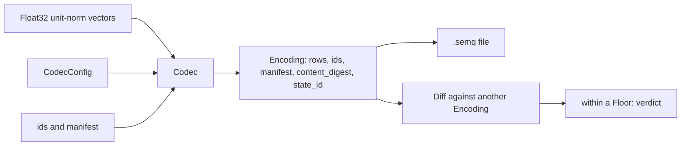

# How SEMQ works

SEMQ turns floating-point vectors into states with an identity. Start with
the [quickstart](quickstart.md) if you want to run code first; this page
explains the objects that example uses.

## From vectors to a state

The Python, Rust, Go, and TypeScript bindings call the same C core. A binding
validates its own representations (dtypes, integer ranges, string encoding),
maps errors and does I/O; every rule that determines bytes or verdicts runs
in the core. TypeScript runs the core as WebAssembly.

SEMQ consumes vectors you already have. It does not generate embeddings, does
not normalize them, and does not search. Keep the mapping from ids to your
application records in your application.

## CodecConfig and Codec

A **CodecConfig** is the rule: one operator and its parameter, for one
dimension. `quant(dim, bins)` keeps a sign and a magnitude bin per
coordinate; `phase(dim, sectors)` keeps an angular sector per coordinate
pair; `orbit(dim, scale)` keeps one discrete symbol per coordinate. A
config has a 13-byte canonical form, and two configs are equal when those
bytes are equal. It exposes what it implies: `bytes_per_vector`,
`units_per_row`, and for quant the range `max_magnitude = 2 / sqrt(dim)`,
computed by the core.

A **Codec** applies a config. It is immutable and safe to share. `encode`
takes unit-norm float32 vectors, their ids and an optional manifest, and
returns an `Encoding`. `decode` returns a float32 representative per row;
`unpack` returns one byte per symbol.

## The input contract

Every row must be float32, finite, and unit-norm within `2^-10` of one in
the sum of squares. Subnormal coordinates are canonicalized to zero before
anything else, so the result does not depend on the flush-to-zero state of
the process. Rows that violate the contract raise `InvalidInput` with the row
index. Encoding requires the round-to-nearest floating-point mode and raises
`Unsupported` otherwise.

## Encoding: a state with an identity

An **Encoding** holds sorted ids, one canonical row per id, a manifest, and
two identities. Ids are either unsigned 64-bit integers or UTF-8 strings
(never mixed); the order is numeric or bytewise. Rows are canonical: every
symbol is in the alphabet and every padding bit is zero, so byte equality
and symbol equality coincide.

`content_digest` is the SHA-256 of the config, the id kind, the count, the
ids and the rows. It answers "same rows under the same rule". `state_id`
is the SHA-256 of `content_digest` and the manifest. It answers "same state
as declared". Two Encodings are equal when their `state_id` is equal.

The **manifest** is a set of string pairs stored verbatim and never
verified. The keys `encoder` and `encoder_revision` are conventions: a diff
reports changes to them, and the CLI gate fails when they change. Two empty
manifests do not attest that the same encoder was used.

`save` and `load` move an Encoding through the `.semq`
[file format](reference/file-format.md). Loading validates framing,
sizes, ids, manifest, both digests and every row before anything
proportional to a declared size is allocated. `concat` merges Encodings of
the same config, kind and manifest with disjoint ids; it is commutative and
associative, and the empty Encoding is neutral.

## Diff and Floor

`reference.diff(candidate)` compares two Encodings of the same config and id
kind. It lists the ids only in the candidate (`added`), only in the
reference (`removed`), and present in both with different rows (`changed`,
each with its hamming distance: the number of units whose symbol differs),
plus the count of unchanged rows and the manifest keys that differ.
`units(id)` shows which units of a changed row moved and to what.

A **Floor** is the envelope of variation observed in rebuilds that changed
nothing on purpose. `Floor.measure(null_diffs)` takes the worst ratio of
changed rows and the largest per-null p99 hamming, and records where it was
measured: the config, the id kind, the reference's `state_id` and how many
nulls went in. A diff is `within` a floor when it removes no rows, shares at
least one row with the reference, changes no more than the floor's ratio of
the shared rows, its p99 hamming does not exceed the floor's, and it changes
neither `encoder` nor `encoder_revision`. Added rows and other manifest
changes do not affect the verdict; the arithmetic is exact integer
arithmetic. Applying a floor to a diff of another reference, config or id
kind is `Incompatible` rather than a verdict. The floor describes observed
variation; it makes no probabilistic claim about the next rebuild.

## What a diff can and cannot tell you

A diff tells you which rows changed, how many units moved, and to which
symbols. It cannot tell you why, and it cannot reconstruct the original
vectors: quantization discards information by design, and `decode` returns
a representative per symbol, not the input. A representative is not
normalized, and re-encoding a representative is not guaranteed to reproduce
the row through `encode`.

## Glossary

| Term | Meaning |
| --- | --- |
| Vector | An ordered numeric representation supplied by your application |
| Dimension (`dim`) | Number of scalar values in one vector |
| Unit | One coordinate for quant and orbit, one coordinate pair for phase |
| Symbol | The integer value of one unit; the alphabet depends on the operator |
| Row / code | The packed bytes of one vector: `bytes_per_vector` bytes |
| Id | The key of a row: `u64` or `utf8`, one kind per Encoding |
| Manifest | String pairs declared with a state and stored verbatim |
| `content_digest` | SHA-256 of config, kind, count, ids and rows |
| `state_id` | SHA-256 of `content_digest` and the manifest |
| Hamming | Units whose symbol differs between two rows of the same id |
| Null diff | A diff between two encodings of the same corpus with no intended change |
| Floor | The envelope of variation observed in null diffs |
| Representative | The float32 vector `decode` returns for a row; approximate |
| Rule revision | The `p2` field of a config; changes when an operator rule changes |

## Next steps

- [Gate a rebuild](guides/gate-a-rebuild.md) with a measured floor.
- [Choose a configuration](guides/choosing-a-config.md) for your data.
- [Read the core contracts](reference/contracts.md).
