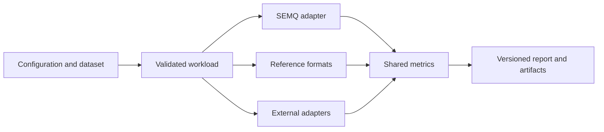

# Benchmark protocol

**Goal:** compare SEMQ and external representations using explicit data,
measured storage, and shared quality definitions.

**Prerequisites:** a developer checkout, Python 3.11 or newer, NumPy, the Python
SDK installed from that checkout, and a native library built from the same
source. Rust, Go and TypeScript users can interpret these results, but this
runner does not measure their binding overhead or verify cross-language parity.

## Scope and architecture

The SDK owns the suite under `benchmarks/`. Every method receives the same
training corpus, searched corpus, queries, reference scores and metric rules.
Adapters call existing implementations. Shared scoring profiles and native estimators
are reported separately.



[Faiss](https://github.com/facebookresearch/faiss) supplies the optional PQ backend.

The implemented workload is **codec quality**. It reconstructs the stored
corpus and computes original-query inner products with float64 accumulation.
The raw profile does not normalize reconstructed embeddings; an optional direction
profile evaluates cosine after normalization. Neither is SEMQ index search,
an optimized compressed-domain scorer, or an application latency benchmark.

## 1. Set up a local run

From the repository root, use a dedicated environment:

```sh
python -m venv .venv-benchmarks
source .venv-benchmarks/bin/activate
python -m pip install -e . pytest
cmake -S . -B build-benchmarks -DCMAKE_BUILD_TYPE=Release \
  -DSEMQ_BUILD_TESTS=OFF -DSEMQ_BUILD_BENCHMARKS=OFF -DSEMQ_ENABLE_SANITIZERS=OFF
cmake --build build-benchmarks --parallel 4
```

Set `SEMQ_LIBRARY_PATH` to the built library file. For example:

```sh
# macOS; use libsemq.so on Linux.
export SEMQ_LIBRARY_PATH="$PWD/build-benchmarks/libsemq.dylib"
python -m benchmarks.run \
  --config benchmarks/configs/quality-smoke.json \
  --output benchmarks/results/quality-smoke-001
```

On Windows, set the environment variable to the generated `semq.dll` and use
your shell's environment activation commands. Output layout can vary by CMake
generator. The runner rejects a missing library file and verifies that loaded
Python binding sources match this checkout, even when an editable installation
resolves through another directory.

The adapters include FP32, FP16, BF16, per-embedding symmetric INT8,
per-dimension affine UINT8, and native SEMQ quant, phase and orbit. The optional configuration
adds PQ, SQ4/SQ8, OPQ + PQ, RaBitQ, TurboQuant MSE, and a binary-sign
baseline to that same report:

```sh
python -m pip install -r benchmarks/requirements-faiss.txt
python -m benchmarks.run \
  --config benchmarks/configs/quality-faiss-smoke.json \
  --output benchmarks/results/quality-faiss-001
```

**Expected result:** a new directory containing `config.json`, `report.json`,
and a code/model NPZ artifact per method. The FP32 quality reference has zero
reconstruction/score error and overlap one. Other values depend on the method.
Synthetic smoke data has no relevance labels, so nDCG is explicitly unavailable.
These runs validate the infrastructure; they are not semantic-quality evidence.

To inspect a report as Markdown grouped by scoring profile:

```sh
python -m benchmarks.render benchmarks/results/quality-smoke-001/report.json
```

## 2. Supply real embeddings

Follow [the SciFact and FiQA guide](benchmark-datasets.md) to prepare full public
corpora with pinned models, stable IDs and embedded provenance.

Pass `--data dataset.npz`. It must contain:

- `corpus`: float32 `(N, D)`, the entire searched corpus in stable row order.
- `queries`: float32 `(Q, D)`, evaluated against every searched row.
- `fit`: float32 `(T, D)`, data available for unsupervised fitting.
- `relevance` (optional): nonnegative numeric `(Q, N)`, aligned to those rows.

Alternatively, supply one-dimensional `qrel_query`, `qrel_document` and
`qrel_score` arrays instead of dense `relevance`. Query/document indices must be
integers within the corresponding arrays; pairs must be unique and scores finite
and nonnegative. Optional `corpus_ids` and `query_ids` map rows to unique external
IDs. An optional scalar JSON string `dataset_provenance` is retained in the report.

All embedding arrays must be nonempty and finite. No normalization is added
on loading. Cosine and inner product are only interchangeable when the relevant
vectors are normalized; reconstructed vectors need not retain unit norm.

The caller owns the split policy. Training on the indexed corpus is permitted
as a declared transductive setting; a separate fit set measures transfer.
Neither setting permits tuning against final evaluation labels. Do not remove
relevant documents from the corpus to make a fit split and then compare the
result with published full-corpus scores. Keep external document/query ID maps,
model and dataset revisions, preprocessing and split provenance with the dataset.
The array and source-file hashes recorded by the runner do not establish those
facts by themselves.

The loader holds datasets and reconstructions in memory. Query batches
bound temporary score matrices, but they do not make corpus memory constant.
Million-row experiments require an appropriate dataset loader and memory
collector; this smoke runner does not claim that scale has been validated.

## 3. Interpret metrics consistently

- **Overlap@k:** intersection of approximate and reference top-k IDs divided by k, averaged over queries.
- **nDCG@k:** linear relevance gains, discount `1/log2(rank+1)`, normalized by ideal DCG within the searched corpus.
- **nDCG delta:** approximate minus reference nDCG on the same eligible queries.
- **Score RMSE / bias:** errors over every query/corpus pair, not a preselected candidate pool.
- **Coordinate MSE:** mean squared error across all reconstructed coordinates.
- **Normalized squared error:** total squared reconstruction error divided by total original squared norm; unavailable for zero total energy.
- **Code bits/dimension:** `8 * code_bytes / (N * D)`.
- **Model bits/dimension:** `8 * model_bytes / (N * D)`; includes per-row scales.
- **Effective bits/dimension:** `8 * (code_bytes + model_bytes) / (N * D)`.
- **Compression ratio:** original FP32 payload bytes divided by code-plus-model bytes.

The reference evaluates the original float32 values with float64 arithmetic.
Ties break by ascending corpus row index. A stable row-to-document mapping is
required for reproducibility. Overlap measures agreement with that reference,
not semantic relevance.

Queries with no positive relevance have undefined nDCG. They are excluded from
the nDCG mean and counted through `ndcg_eligible_queries`; their per-query values
are JSON null. Missing labels and all-zero relevance have different statuses.
Relevance metrics describe the supplied judgments, which can be incomplete.

Per-query values are retained for paired uncertainty analysis. Optional
`uncertainty` settings enable paired query bootstrap intervals for nDCG changes
against the reference. Multiple-seed aggregation, relevance recall, angular error,
clipping rate and Spearman are not implemented in this runner. Do not imply that
one seed or one dataset establishes superiority.

## 4. Know what each representation stores

- **FP32:** original float32 values; no fitted model.
- **FP16:** float16 conversion; overflow fails the run explicitly.
- **BF16:** nearest-even conversion, gradual underflow, explicit overflow rejection.
- **INT8 per embedding:** symmetric `absmax/127`, levels `[-127,127]`, nearest-even rounding; one float32 scale per row.
- **UINT8 per dimension:** training minima/maxima, 256 endpoint levels, nearest-even rounding and clipping; float32 offset and scale per dimension.
- **SEMQ quant:** native encoding/reconstruction; `CodecConfig.quant(dim, bins)` uses the dimension-derived range and packs the codes.
- **SEMQ phase:** native angular encoding/reconstruction; explicit sector count; no added radii or normalization.
- **SEMQ orbit:** native coordinate encoding/reconstruction; explicit scale and fixed 19-symbol alphabet.
- **Faiss PQ:** upstream ProductQuantizer; explicit subquantizer count, bits and seed; centroid array and shape metadata.
- **Binary sign:** packed coordinate signs (`zero >= 0`), little-endian bit order, one float32 mean-absolute-value scale per row.
- **Faiss SQ:** per-dimension trained MinMax ranges; 4, 6 or 8 bits, with upstream rounding and reconstruction.
- **Faiss OPQ + PQ:** learned square rotation followed by PQ; explicit subquantizers, bits per subquantizer, seed and training iterations.
- **Faiss RaBitQ:** seeded random square rotation, upstream 1–8 bit encoding and correction factors; unquantized queries (`qb=0`).
- **Faiss TurboQuant MSE:** seeded random square rotation, per-row normalization with stored float32 norms, upstream `QT_*bit_tqmse` scalar codec.

phase requires even dimensions, or dimensions divisible by four when
`sectors <= 16`; the adapter rejects incompatible dimensions without padding.
In that range, phase stores two symbols per byte. orbit stores one byte per
coordinate. All SEMQ artifacts retain their reconstruction
configuration, and reports identify the native library used. These adapters
evaluate the implemented operators, without experimental corrections.

### Choose comparison families

Use FP16/BF16 to measure simple reduced-precision storage, INT8/UINT8 and Faiss
SQ for scalar quantization, and PQ/OPQ for trained subvector representations.
Binary signs test an inexpensive sign-only representation. RaBitQ and TurboQuant
MSE add rotated low-bit methods with distinct estimators. These families answer
different trade-offs; compare quality at measured total storage, with training
requirements and scoring profiles visible. orbit is a coordinate-level control.

### SEMQ configuration and interpretation

`CodecConfig.quant(dim, bins)` requires unit-norm corpus embeddings and derives
its range from the dimension. The benchmark adapter accepts a `bits` setting;
when omitted, it chooses four bins per sign, or **3 bits per dimension**.
This is a benchmark baseline, not a default of `CodecConfig.quant`. Both smoke
configurations name this method `quant_default`. Resolved parameters are
recorded alongside the requested configuration.

phase reconstructs each coordinate pair on a unit circle, giving a reconstructed
norm of `sqrt(D/2)`. Its raw MSE therefore includes a scale mismatch for unit-norm
inputs. Use the direction profile to assess angular distortion separately;
normalization does not recover the discarded relative pair magnitudes.

orbit serves as a coordinate-level representation in this comparison. The
benchmark configurations identify its integer scale explicitly.

Packed operator payloads are the codec output only. A packed quant or phase
result here is not the storage size of any derived structure an application
builds on top of the codes.

BF16 conversion here preserves representable subnormals. It does not emulate
hardware that flushes them to zero. Constant training dimensions in the affine
UINT8 baseline reconstruct to the training constant. INT8 zero rows reconstruct
to zero. Integer scales that underflow float32 are rejected explicitly. These baseline definitions are part of the method identity; a different
range or rounding rule is a different configuration.

The optional backend is pinned in `benchmarks/requirements-faiss.txt`. These
names identify that implementation, not every algorithm sharing the family name.
TurboQuant MSE supports 1, 2, 3, 4 and 8 bits; it does **not** include the QJL
residual correction used in the product-estimation variant. Its adapter restores
row magnitudes after decoding; zero rows retain zero magnitude. The binary-sign
baseline is coordinate thresholding, not random-projection SimHash or RaBitQ.

OPQ requires dimensions divisible by its subquantizer count. Its `iterations`
parameter controls rotation-training and PQ-training iteration limits; the smoke
configuration uses 20. No adapter pads dimensions silently. Random rotations are
stored as full float32 matrices, so their quadratic model size is charged even
when it dominates a small corpus. This is not a fast Hadamard implementation.

`model_bytes` counts persisted model array payloads, including per-row scales.
For SQ, OPQ, RaBitQ and TurboQuant MSE, this includes a serialized **trained
empty Faiss index**, including its headers, plus any rotation and row norms.
Corpus codes are stored separately and counted once. This preserves backend
state without assuming its internal layout. Other adapters store explicit model
arrays. The accounting excludes NPZ container headers and configuration JSON. The NPZ file's
actual size is reported separately and is not an SDK index image. No compression
ratio in this workload claims full-index or process-memory savings. Comparisons
must use measured budgets; equal nominal bits do not ensure equal total bytes.

### Compare normalized directions

Set `"direction_scoring": true` to normalize original queries, original corpus
embeddings and decoded representatives before float64 cosine scoring. Both smoke
configurations enable it. This profile reports its own overlap, nDCG, score error
and unit-coordinate MSE. Encoding and stored bytes stay unchanged. Any zero-norm
row makes this profile `not_comparable`, with counts; rows are not silently removed.

### Compare method-specific scoring

Set `"method_scoring": true` to evaluate the optional scorer alongside the common
reconstruction profile. The Faiss smoke configuration enables it. Each method's
`method_scoring` result contains its own profile, score error, retrieval metrics
and per-query observations. Unsupported scorers report `not_supported`; they do
not silently substitute reconstruction scoring. Without the option, the status
is `not_requested`.

SQ, OPQ, RaBitQ and TurboQuant MSE use exhaustive Faiss search with original
float32 queries, transformed into the encoded coordinate system. Every corpus
row is scored; there is no ANN candidate selection or reranking. RaBitQ disables
query quantization. TurboQuant's stored row norms rescale its scores. Rankings
use the same row-ID tie policy as the common profile.

This path measures estimator quality, not native search latency: Faiss searches
all corpus rows per query batch and the runner restores corpus-row score order. It does not exercise IVF, HNSW, FastScan,
or SEMQ index search. In particular, RaBitQ's native estimator can differ from
inner products against its decoded representatives. Keep the two profiles
separate when comparing methods; neither profile replaces the other.

In the pinned Faiss backend, multibit RaBitQ decoding exposes the one-bit
representative rather than its full estimator. Those methods report
`not_comparable` for raw and directional reconstruction quality. Their native
estimator remains available. Do not interpret the missing reconstruction metrics
as zero error or poor retrieval.

## 5. Preserve an auditable report

`schema_version: 2` identifies the output contract; configuration files remain
version 1. Version 2 adds explicit reconstruction comparability, the direction
profile, resolved parameters and code/model storage breakdowns. A successful report contains:

- `suite` and `scoring_profile`, identifying what was evaluated.
- `provenance`, including source revision, dirty-tree status, tool versions,
  benchmark source hashes, and the native library hash when SEMQ is used.
- `dataset`, identifying source type, array shapes and hashes.
- `methods`, containing each configuration, storage counts, artifact hash,
  quality metrics, comparability statuses and per-query values.
- Explicit `not_measured` statuses for performance, memory and portability.

Output directories cannot be reused. Failures after initialization retain a
`failure.json`; partial artifacts must not be interpreted as successful runs.
Heavy artifacts remain outside Git. Publish compact reports only after checking
methodology, licensing and whether the data is suitable for redistribution.

Do not combine results from different scoring profiles or schema definitions
without an explicit conversion. External adapters must identify their backend
and version, retain required model state, and pass reconstruction/size tests.
Optional dependencies belong in benchmark requirements, not SDK runtime extras.

## 6. Summarize latency samples

The metric utility already summarizes nanosecond observations using nearest-rank
p50, p95, p99 and p99.9. By default a percentile needs at least 100 expected
observations above its population cutoff: 200, 2,000, 10,000 and 100,000 total
samples respectively. Below that policy threshold it is `insufficient_samples`,
not zero. This is a configurable reporting policy, not a confidence guarantee.

## Validation and next steps

Run `python -m pytest benchmarks/tests -q`. Faiss-specific validation skips when
its optional dependency is absent. Tests check hand-computable metric cases,
conversion boundaries, native equivalence, stored model sufficiency, invalid
inputs and missing-metric semantics. They do not enforce timing thresholds.

CI validates tests, formatting and benchmark types on pull requests and pushes
to `main`. Only pushes to `main` execute smoke evaluations and publish readable
job summaries and JSON artifacts (retained for 30 days). There is no periodic
schedule. The current synthetic report is compared with the previous successful
`main` report available among the last 20 successful runs. Input arrays, model,
configuration, scoring protocol, numerical dependency versions, Python minor
version and runtime platform must match. On Linux, compatibility uses the system,
architecture and libc, while the full kernel string remains informational for
this quality/storage workload. SDK revision changes are allowed so operator
changes can be observed. A changed metric implementation requires a new baseline.

The comparison reports quality changes above an absolute `0.0001`, error-metric
changes above `1e-8`, storage-byte changes, and availability changes. These are
informational alerts, not statistical significance tests or merge gates. Missing
or incompatible baselines are explicit statuses. No search timings are compared.
The [public results](benchmark-results.md) are separately frozen evaluations;
they are not recomputed by the synthetic CI job.

Before publishing comparisons, freeze real datasets and their split policy,
choose storage budgets and quality targets, inspect paired uncertainty,
and measure the actual SDK search profile separately.

- [Cost evaluation](cost-evaluation.md): model economic scenarios without inferring savings from compression alone.
- [Conformance vectors](https://github.com/The-SEMQ-Group/semq/tree/main/tests/conformance): the byte-identity guarantee and its scope.
- [Choosing a configuration](choosing-a-config.md): select an operator for your workload.
