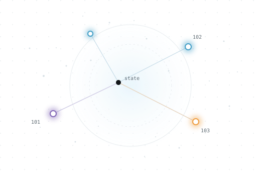

  <section class="semq-hero" aria-labelledby="semq-hero-title">
    

      
SEMQ / SDK DOCUMENTATION

      <h1 id="semq-hero-title">Inspect changes between embedding rebuilds.</h1>
      
Encode unit-norm float32 vectors as deterministic symbolic rows. Save a <code>.semq</code> state, compare versions by id, and gate changes against variation measured in your pipeline. A hash of the floats says whether the bytes changed; SEMQ says whether the state did, and where.

      

        <a class="md-button md-button--primary" href="quickstart/">Run the quickstart →</a>
        <a class="md-button" href="reference/contracts/">Read the contracts</a>
      

      
C core / Python · Rust · Go · TypeScript/WASM / <a href="benchmarks/scale/">Cross-platform bytes</a>

    

    <figure class="semq-hero__figure" aria-label="Schematic transition from continuous coordinates to a discrete symbolic state">
      

        
        <canvas class="semq-hero__canvas" width="520" height="340" aria-hidden="true"></canvas>
      

    </figure>
  </section>

  <section class="semq-section semq-demo" data-semq-demo aria-labelledby="semq-demo-title">
    

      

        
INTERACTIVE EXAMPLE / 01

        <h2 id="semq-demo-title">Same corpus. What moved?</h2>
        
Switch the candidate to see how a state diff separates unchanged rows, changed symbols, and new ids.

      

      <a class="semq-text-link" href="concepts/#diff-and-floor">How diff works →</a>
    

    

      <button type="button" class="semq-switch is-active" data-scenario="same" aria-pressed="true">No change</button>
      <button type="button" class="semq-switch" data-scenario="changed" aria-pressed="false">One row changed</button>
      <button type="button" class="semq-switch" data-scenario="added" aria-pressed="false">One id added</button>
    

    

      

        
REFERENCE<code>55d5acf0caf9…</code>

        
101<code>b6 0d</code><i aria-label="unchanged">=</i>

        
102<code>b2 0d</code><i aria-label="unchanged">=</i>

        
103<code>96 0d</code><i aria-label="unchanged">=</i>

      

      
→

      

        
CANDIDATE<code data-candidate-id>55d5acf0caf9…</code>

        

          
101<code>b6 0d</code><i aria-label="unchanged">=</i>

          
102<code>b2 0d</code><i aria-label="unchanged">=</i>

          
103<code>96 0d</code><i aria-label="unchanged">=</i>

        

      

    

    

      =
      
<strong data-result-title>Identical states</strong>
0 changed · 0 added · 0 removed. The state ids match.

    

    
A fixed walkthrough of actual <code>quant(dim=4, bins=4)</code> output. The controls select precomputed results; encoding runs in the SDK, not in this page. <a href="quickstart/">Run the same example yourself.</a>

  </section>

  <section class="semq-section" aria-labelledby="semq-flow-title">
    

WORKFLOW / 02
<h2 id="semq-flow-title">From vectors to a verdict.</h2>

    

      
01<h3>Encode a state</h3>
Give SEMQ unit-norm float32 vectors, stable ids, a codec rule, and a manifest. Save the result as <code>.semq</code>.
<a href="quickstart/">Run the quickstart →</a>

      
02<h3>Measure normal variation</h3>
Compare rebuilds that changed nothing on purpose. A <code>Floor</code> captures the variation you actually observed.
<a href="guides/gate-a-rebuild/">Measure a floor →</a>

      
03<h3>Gate the candidate</h3>
Diff by id to find changed symbolic rows. Use <code>within</code> for the gate and inspect the changes when it fails.
<a href="reference/cli/">See CLI commands →</a>

    

  </section>

  <section class="semq-section" aria-labelledby="semq-paths-title">
    

DOCUMENTATION MAP / 03
<h2 id="semq-paths-title">Choose what you need.</h2>

    

      <a href="quickstart/">LEARN<strong>Run the quickstart</strong><small>A runnable tutorial in four languages.</small><b aria-hidden="true">↗</b></a>
      <a href="guides/">DO<strong>Solve a task</strong><small>Gate a rebuild or choose a codec.</small><b aria-hidden="true">↗</b></a>
      <a href="concepts/">UNDERSTAND<strong>Understand the model</strong><small>Identities, manifests, diffs, and floors.</small><b aria-hidden="true">↗</b></a>
      <a href="reference/">LOOK UP<strong>Check the contract</strong><small>APIs, CLI, bytes, and error rules.</small><b aria-hidden="true">↗</b></a>
    

  </section>

